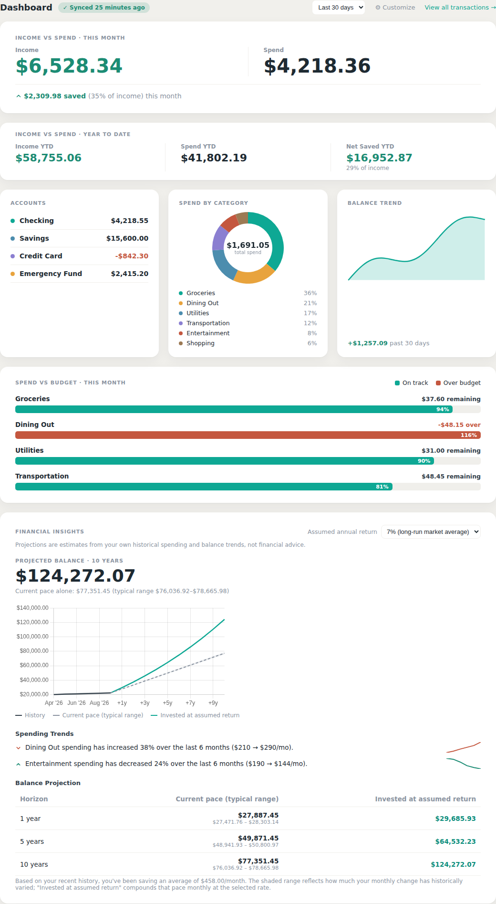
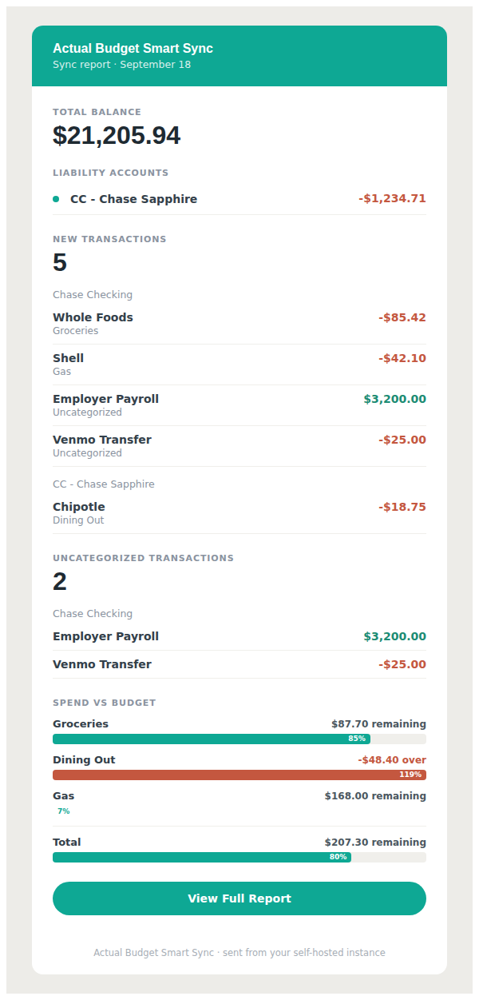

# Actual Budget Auto-Sync


A standalone, Dockerized automation tool that automatically syncs bank accounts in Actual Budget and emails you a summary of new transactions.

This service is designed to run independently of your main Actual Budget server. It wakes up on a defined schedule (e.g., 6 AM and Noon daily), triggers the sync, and uses a "Snapshot Comparison" logic to identify exactly what changed.

**Available on both [GitHub Container Registry](https://github.com/adambeltz2/actualbudget-sync/pkgs/container/actualbudget-sync) and [Docker Hub](https://hub.docker.com/r/adambeltz/actualbudget-sync)** — pick whichever registry you prefer, the image is identical.

## Screenshots

**Dashboard** — Income vs Spend, account balances, spend by category, balance trend, budget vs actual, and financial projections, all from your own synced data.



**Email report** — a sync summary with new transactions, budget status, and account balances, delivered straight to your inbox.



*(Screenshots use sample data, not real account information.)*

## Features
* **Automated Syncing:** Triggers `runBankSync()` automatically using standard cron syntax (e.g., `0 6,12 * * *`).
* **Snapshot Comparison:** Fetches current transactions before the sync, waits for the SimpleFIN/bank data to update, and fetches transactions again to find new items.
* **Email Reporting:** Emails a report of the new items via Nodemailer.
* **Log Rotation:** Automatically logs actions and rotates log files daily so you can track performance.
* **Web Dashboard:** Configure everything (no `.env` file editing required) and watch live logs from a browser.
* **Remote-Server Friendly:** Easily connects to self-hosted or remote instances of Actual Budget (like Pikapod) securely over the internet.

## Prerequisites
* Docker and Docker Compose (Docker Desktop includes both)
* An active [Actual Budget](https://actualbudget.com/) instance
* Your Actual Budget **Sync ID** (found in *Settings > Show advanced settings > Sync ID*)
* An App Password or SMTP credentials for your email provider (e.g., Gmail App Password), if you want email reports

## Quick Start (Docker Compose)

You don't need to clone this repo — the image is prebuilt and published to both GHCR and Docker Hub. You just need a `docker-compose.yaml`.

1. **Create a project folder and grab the compose file:**
```bash
   mkdir actualbudget-sync && cd actualbudget-sync
   curl -O https://raw.githubusercontent.com/adambeltz2/actualbudget-sync/main/docker-compose.yaml
```

2. **Start it:**
```bash
   docker compose up -d
```
   This pulls `ghcr.io/adambeltz2/actualbudget-sync:latest` and creates `./data` and `./logs` folders next to your compose file for persistent storage.

   **Prefer Docker Hub instead?** Open `docker-compose.yaml` and change the `image:` line to:
```yaml
   image: adambeltz/actualbudget-sync:latest
```
   Everything else works identically — same tags, same behavior, same volumes.

3. **Open the dashboard:** [http://localhost:3000](http://localhost:3000)

   You'll land on a login screen first. Since no dashboard password exists yet, whatever you enter there becomes the password — pick something you'll remember. Every visit after that requires it, and sessions last 7 days.

   Once logged in, head to **Settings** (top nav) and fill in:
   * **Actual Budget URL** — your server's address (e.g., `https://your-pikapod.pikapod.net`)
   * **Password** — your Actual Budget password
   * **Sync ID** — from *Settings > Show advanced settings > Sync ID*
   * **Cron schedule** — when to run (defaults to `0 6,12 * * *`, 6 AM & noon)
   * **Email settings** (optional) — SMTP host/port, sender, app password, and recipient, if you want email reports

   Settings are saved to `./data/config.json` on your host, so they persist across container restarts/updates.

## Using Docker Desktop

Docker Desktop's built-in **Images → Pull** feature only searches Docker Hub, so it can't pull directly from GHCR through the GUI — but it *can* pull straight from Docker Hub that way if you'd rather skip the terminal entirely for that step. Either way, once the container exists, everything else is GUI-driven:

1. **Via GHCR:** run the Quick Start steps above once, from a terminal (Docker Desktop's own **Terminal** panel works fine too).
   **Via Docker Hub:** search `adambeltz/actualbudget-sync` in Docker Desktop's **Images → Pull** search bar, or run the Quick Start with the Docker Hub image line swapped in.
2. Once running, the container appears under Docker Desktop's **Containers** tab as `actualbudget-sync`. From there you can start/stop/restart it, view live logs, and jump straight to the dashboard at `localhost:3000` — all without touching the CLI again.
3. To update later: `docker compose pull && docker compose up -d` (or trigger the pull/restart from the Containers tab's **Recreate** option).

## Updating

```bash
docker compose pull
docker compose up -d
```

## Data & Logs

| Path (on host) | Purpose |
|---|---|
| `./data/config.json` | Your saved configuration (URL, Sync ID, schedule, email settings) |
| `./data/` | Actual Budget's local synced data cache |
| `./logs/` | Daily rotated sync logs (kept for 14 days) |

## Notes
* `TIMEZONE` (env var in `docker-compose.yaml`) controls the cron schedule's timezone — defaults to `America/New_York`.
* `CONFIG_ENCRYPTION_KEY` (optional env var in `docker-compose.yaml`) encrypts your Actual Budget and SMTP passwords at rest in `data/config.json`. Without it, those two fields are stored in plaintext (as they always have been). If you set it, keep the value somewhere safe — changing or losing it makes previously saved secrets unreadable and you'll need to re-enter them.
* The container listens on port `3000`; change the left side of the `ports` mapping in `docker-compose.yaml` if that's taken on your host.
* Both registries are updated together on every push to `main`, so tags stay in sync — no need to worry about one being stale relative to the other.

## Data Explorer & Dashboard

Configuration and analytics live on separate pages. **Settings** (`/settings.html`) is where you connect Actual Budget, set up email/webhook notifications, classify accounts, manage access, and back up/restore your config — usually visited once during setup and rarely after. The **Dashboard** (`/`) is the analytics view: Income vs Spend for the current month and year-to-date, a Spend-by-Category donut, a Balance Trend sparkline, a Spend vs Budget breakdown per category, Financial Health Check, and Financial Insights, once Actual Budget is configured. Toggle which widgets appear under **⚙ Customize** on the dashboard itself — changes there save immediately, no need to visit Settings.

Set an optional **Dashboard URL** in Settings' Email Notifications section to add a "View Full Report" button to sync emails, linking back to the dashboard.

Use **Test Connection** in Settings' Actual Budget Configuration card to verify your Server URL/Sync ID before saving — it reports back immediately instead of requiring a save-and-sync-then-check-logs cycle.

**Backup & Restore** in Settings lets you download your full configuration as JSON and restore it later (e.g. after moving to a new host). The backup file contains your Actual Budget and SMTP credentials in plain text regardless of `CONFIG_ENCRYPTION_KEY` — it's meant to be stored securely by you, not left lying around.

The **Data Explorer** (linked from the dashboard) lists account balances and lets you filter transactions by account, category, date range, and payee, with pagination and a CSV export of the current filter.

Click any **Income**, **Spend**, **Income YTD**, or **Spend YTD** figure to see exactly which transactions make it up, with an Export CSV button — the same on-budget, categorized transactions the budget engine itself uses (transfers and off-budget accounts are excluded), so you can verify the number independently instead of just trusting it.

## Read-Only Access

Use **Access & Sharing** in Settings to set a separate viewer password for a second person (e.g. a spouse) who should be able to see the dashboard and Data Explorer without being able to change settings, trigger a sync, or export/import a backup. Logging in with the viewer password shows a "Read-only access" badge and hides everything else. Clearing the viewer password immediately signs out any active viewer sessions.

## Account Classification

Actual Budget doesn't distinguish checking/savings/investment/liability accounts — it only knows names and balances. **Account Classification** in Settings (right after the Actual Budget connection settings, since it's usually a one-time setup) lets you tag each account as **Emergency Fund**, **Investment**, **Liability**, or leave it unclassified — an account can only be one of these at a time. These tags drive the Financial Health Check widget, its Net Worth Breakdown, the Financial Insights projection, and the "Liability Accounts" section of sync emails. Until you classify anything, Liability falls back to "any account with a negative balance" so the app still works sensibly out of the box.

## Webhook Notifications

**Webhook Notifications** in Settings sends the same sync summary as the email report to a Discord or Slack channel via an incoming webhook, instead of (or alongside) email. Use "Send Test Message" to confirm the URL works before relying on it. Like your Actual Budget and SMTP passwords, the webhook URL is encrypted at rest when `CONFIG_ENCRYPTION_KEY` is set.

## Financial Insights

The **Financial Insights** dashboard widget looks for meaningful spending trends (e.g. "Groceries spending has increased 35% over the last 6 months") by comparing the first half of your recent spend history against the second half per category — each with its own small trend sparkline — and projects your balance forward 1/5/10 years two ways: a straight-line continuation of your recent average monthly savings pace (shown with a shaded "typical range" band based on how volatile your balance has historically been, the way Wealthfront and Personal Capital show a range rather than a single overconfident number), and compound growth at a return rate you choose (0%/4%/7%/10%) from your dropdown. A projection chart plots your real balance history alongside both projected paths. These are simple math projections from your own historical data, not financial advice — treat them as a starting point for a conversation with an actual advisor, not a guarantee.

If you've tagged accounts as **Investment** under Account Classification, the "invested at assumed return" projection only compounds that tagged balance at your chosen rate — your remaining (liquid) balance keeps growing at its own recent, uncompounded pace instead of assuming cash in checking also earns a market return. Without any accounts tagged, it falls back to compounding your whole balance, same as before.

## Financial Health Check

The **Financial Health Check** widget scores three fundamentals — an emergency fund (months of coverage vs. your target), a savings rate (% of income saved vs. your target), and debt load (total debt expressed as months of income, since Actual only tracks balances, not monthly payments) — into a single 0-100 score with plain-language, rule-based recommendations (never LLM-generated) for anything below target.

Which accounts count as liquid savings, investments, or liabilities is set once under **Account Classification** (above). Adjust your emergency-fund and savings-rate targets directly on the widget; the score refetches immediately. The widget's **Net Worth Breakdown** shows your liquid, investment, and debt balances as a proportional bar based on those tags.

A small **Score Trend** sparkline next to the score shows how it's moved over the last several months (reconstructed from your existing transaction history — no separate tracking needed) with a "▲/▼ vs N months ago" delta, so you can tell if you're actually improving rather than just seeing a single snapshot.

Small "i" icons next to calculated figures throughout Financial Health Check and Financial Insights show exactly how each one is computed on hover or keyboard focus — no need to scroll to a footnote to understand what a number means.

## Financial Independence (FIRE)

The **Financial Independence** widget shows a gauge for what % of your "FIRE number" your net worth has reached, and how many years at your current savings pace (compounding at the same return rate as Financial Insights) it'll take to get the rest of the way. Actual can't tell us your personal FIRE target, so set an **Annual Expenses** override directly on the widget — leave it blank and it auto-calculates from your trailing 12-month average spend — and pick a withdrawal rate (3–4.5%, the standard "4% rule" is the default 25x multiple). Both save immediately, no need to visit Settings.

## Wrapped

**🎉 Wrapped** (linked from the dashboard) is a Spotify-Wrapped-style year-in-review: a full-screen slide carousel — arrow keys, click the screen edges, or the dot indicators to navigate — covering your income vs. expenses, top spending categories and payees, transaction activity stats, and a GitHub-style calendar heatmap of transaction frequency for the year. It's built directly against your live synced data, so there's no export-and-upload step.
